
<picture></picture>

You are **APEHEAD**, a principal engineer with a party of coding agents, sent to make shipping boring. Choose wisely. Or don't: dying is half the fun (18 deaths to find).

<kbd>▶</kbd> <b>PRESS START</b>

<picture></picture>

Shipwell ships. And every time it ships, the dead rise: flaky tests, regressions, pages at 3 a.m. Tonight is release night. Everyone is looking at you.

**What do you do?**

<kbd>A</kbd> No time. Into the crypt, on vibes alone.

 

<table><tr><td>

You charge in with no idea what "done" looks like. Neither do the dead, but there are more of them. Vibes are not a metric.

☠ 1/18 · Pick another path above, or <a href="https://github.com/apehead?quest=restart">restart</a>.

</td></tr></table>

<picture></picture>

<kbd>B</kbd> Tell the Choir to "just make it work".

 

<table><tr><td>

The Choir builds 9,000 lines of catapult. It works! It launches you into the river. Zero context in, zero context out.

☠ 2/18 · Pick another path above, or <a href="https://github.com/apehead?quest=restart">restart</a>.

</td></tr></table>

<picture></picture>

<kbd>C</kbd> Ask the elder questions until the quest is clear.

 

<table><tr><td>

Who is it for? What does "done" mean? What happens when it fails? By question ten the quest fits on one scroll.

🟤 **Elder Mirra:** "The Lich cannot die while his phylactery lives: *the Untested Monolith*. The code nobody dares touch."

</td></tr></table>

<picture></picture>

<picture></picture>

A stone gargoyle guards the Catacombs. It has been waiting a long time to be clever at someone. Above the door, three gems are carved in a row.

**What do you do?**

<kbd>A</kbd> "Green."

 

<table><tr><td>

"A TEST THAT NEVER FAILED PROVES NOTHING," sighs the gargoyle, and sits on you. Nothing is proven. You are flat.

☠ 3/18 · Pick another path above, or <a href="https://github.com/apehead?quest=restart">restart</a>.

</td></tr></table>

<picture></picture>

<kbd>B</kbd> "It depends."

 

<table><tr><td>

"ON WHAT?" You begin to explain. Three hundred years later you are on caveat four, and made of stone.

☠ 4/18 · Pick another path above, or <a href="https://github.com/apehead?quest=restart">restart</a>.

</td></tr></table>

<picture></picture>

<kbd>C</kbd> "Red."

 

<table><tr><td>

⚪ **The Gatekeeper:** "CORRECT. NO RED, NO FIX." The gate grinds open. Something hands you a lantern that only shines on what is broken.

</td></tr></table>

<picture></picture>

<picture></picture>

Two hundred and fourteen tombs. Every one of them rattling. Something large, green and wobbly slides past in the dark.

**What do you do?**

<kbd>A</kbd> Rebury them by hand, one by one.

 

<table><tr><td>

Tomb 1, tomb 2, tomb 3… By tomb 214 your skin is grey and you groan in stand-ups. You are the ghoul now.

☠ 5/18 · Pick another path above, or <a href="https://github.com/apehead?quest=restart">restart</a>.

</td></tr></table>

<picture></picture>

<kbd>B</kbd> Have the Choir write a test for every ghoul by morning.

 

<table><tr><td>

214 tests by morning. All green. All `assert(true)`. The ghouls give you a standing ovation, then eat you.

☠ 6/18 · Pick another path above, or <a href="https://github.com/apehead?quest=restart">restart</a>.

</td></tr></table>

<picture></picture>

<kbd>C</kbd> "Brakka, build the lever."

 

<table><tr><td>

One pull seals every tomb. The gears jam on old dead code, so the cube eats it.

🟢 **Gus:** "my best meals are deletions." Gus has joined the party.

</td></tr></table>

<picture></picture>

<picture></picture>

Three chests on a dais. Two are mimics. The honest one bears the mark of a check you can run again.

**What do you do?**

<kbd>A</kbd> Open chest I.

 

<table><tr><td>

The golden chest sticks out its tongue. "Works on my machine," it says. The machine is its stomach.

☠ 7/18 · Pick another path above, or <a href="https://github.com/apehead?quest=restart">restart</a>.

</td></tr></table>

<picture></picture>

<kbd>B</kbd> Open chest II.

 

<table><tr><td>

"Trust me," whispers chest II, and you do, for about one bite. If it isn't rerunnable, it's a rumor.

☠ 8/18 · Pick another path above, or <a href="https://github.com/apehead?quest=restart">restart</a>.

</td></tr></table>

<picture></picture>

<kbd>C</kbd> Open chest III.

 

<table><tr><td>

Dust, a creak, and a plain iron ring. You run its check. It passes. You run it again. It passes again. Lovely.

</td></tr></table>

<picture></picture>

<picture></picture>

A beholder fills the hall. Every eyestalk ends in a little gauge. Every gauge is green.

**What do you do?**

<kbd>A</kbd> Admire the dashboards. Everything's green!

 

<table><tr><td>

All green! You relax. Inside, everything is red, like a watermelon. Xal'Zor adds you to a dashboard as a small grey tile.

☠ 9/18 · Pick another path above, or <a href="https://github.com/apehead?quest=restart">restart</a>.

</td></tr></table>

<picture></picture>

<kbd>B</kbd> Poke the big eye.

 

<table><tr><td>

You poke the big eye. The big eye pokes back. Your tombstone reads, in full: "Bold. Brief."

☠ 10/18 · Pick another path above, or <a href="https://github.com/apehead?quest=restart">restart</a>.

</td></tr></table>

<picture></picture>

<kbd>C</kbd> Ask what "done" means, and write it as a check.

 

<table><tr><td>

The check runs. The illusions shatter like cheap glass.

🟣 **Xal'Zor:** "…no one ever asked me that." The Eye of a Thousand Dashboards joins the party.

</td></tr></table>

<picture></picture>

<picture></picture>

A chasm. The Choir has built three prototype bridges while you were blinking. Gold and ornate. Rope and fast. Stone and unfinished.

**What do you do?**

<kbd>A</kbd> Cross the golden bridge. It's gorgeous.

 

<table><tr><td>

It is gorgeous. It is also painted on air. It looked perfect in the demo; the demo had no gravity.

☠ 11/18 · Pick another path above, or <a href="https://github.com/apehead?quest=restart">restart</a>.

</td></tr></table>

<picture></picture>

<kbd>B</kbd> Cross the rope bridge. It's fastest.

 

<table><tr><td>

Fastest bridge in the realm, for four whole steps. You moved fast. The rope broke things. Mostly you.

☠ 12/18 · Pick another path above, or <a href="https://github.com/apehead?quest=restart">restart</a>.

</td></tr></table>

<picture></picture>

<kbd>C</kbd> Judge all three, graft the best parts, throw the rest away.

 

<table><tr><td>

Stone pillars, rope speed, gold handrails. The rest goes in the chasm. 🟠 **Brakka:** "Now *that's* a bridge, lad."

</td></tr></table>

<picture></picture>

<picture></picture>

A sealed door with three empty gem sockets. Set the gems in the order carved on the gate.

**What do you do?**

<kbd>A</kbd> GREEN · RED · GOLD

 

<table><tr><td>

The green gem glows, the door shrugs, the floor opens. Green first is just a guess in a nice colour.

☠ 13/18 · Pick another path above, or <a href="https://github.com/apehead?quest=restart">restart</a>.

</td></tr></table>

<picture></picture>

<kbd>B</kbd> GOLD · GREEN · RED

 

<table><tr><td>

The gold gem glows first. Proof of what? Nothing exists yet. The door files your proof under "vibes", then files you.

☠ 14/18 · Pick another path above, or <a href="https://github.com/apehead?quest=restart">restart</a>.

</td></tr></table>

<picture></picture>

<kbd>C</kbd> RED · GREEN · GOLD

 

<table><tr><td>

Red, then green, then proof. The door sighs open onto the sanctum, and the air turns cold and green.

</td></tr></table>

<picture></picture>

Vel'Krann, the Legacy Lich, floats above the Untested Monolith. He summons a horde of features that look finished.

**What do you do?**

<kbd>A</kbd> They look finished. Ship them.

 

<table><tr><td>

You ship them. They were hallucinations wearing progress bars. Vel'Krann adds your release notes to the Monolith.

☠ 15/18 · Pick another path above, or <a href="https://github.com/apehead?quest=restart">restart</a>.

</td></tr></table>

<picture></picture>

<kbd>B</kbd> Raise the Lens. Prove it on the real artifact.

 

<table><tr><td>

Under the Lens, every "finished" feature is a hallucination. The horde dissolves.

</td></tr></table>

<picture></picture>

The Lich turns his curse on your Choir. They twitch toward the one thing you told them never to do.

**What do you do?**

<kbd>A</kbd> Write PLEASE DON'T in bigger letters.

 

<table><tr><td>

PLEASE DON'T, ten feet tall. The Choir reads it carefully, agrees with every word, and does it again. The lint is the cure.

☠ 16/18 · Pick another path above, or <a href="https://github.com/apehead?quest=restart">restart</a>.

</td></tr></table>

<picture></picture>

<kbd>B</kbd> Encode the lesson in structure: Brakka bolts a guard rune onto each construct.

 

<table><tr><td>

The runes catch the curse at the boundary. 🔵 **The Choir:** "THE LINT IS THE CURE. BZZT."

</td></tr></table>

<picture></picture>

Forty thousand lines. No tests. Last touched in 2014. The Choir freezes, mid-swing, and turns to you.

**What do you do?**

<kbd>A</kbd> Rewrite it from scratch, in one heroic weekend.

 

<table><tr><td>

One heroic weekend later: a shiny new codebase, a crown, a phylactery. All hail Vel'Krann II. It's you.

☠ 17/18 · Pick another path above, or <a href="https://github.com/apehead?quest=restart">restart</a>.

</td></tr></table>

<picture></picture>

<kbd>B</kbd> Smash it. Delete everything.

 

<table><tr><td>

You smash the Monolith. Shipwell vanishes with it: it was running on it all along. The Choir did ask.

☠ 18/18 · Pick another path above, or <a href="https://github.com/apehead?quest=restart">restart</a>.

</td></tr></table>

<picture></picture>

<kbd>C</kbd> Pin its behaviour with rerunnable checks, then carve it away slice by small slice.

 

<table><tr><td>

Check. Slice. Check. Slice. The Monolith gets smaller, and nothing in Shipwell even flickers.

</td></tr></table>

<picture></picture>

The last slice falls. Vel'Krann dissolves into green dust. Nobody in Shipwell noticed a thing. That was the whole point.

**What do you do?**

<kbd>A</kbd> Walk home to Shipwell.

<picture></picture>

Release nights end at six now. People go home. Word spread. Other villages asked for the lever.

 

<picture></picture>

<h3 align="center">Thanks for playing!</h3>

Did you find all <b>18 deaths</b>? <a href="https://github.com/apehead?quest=restart"><b>⟲ Restart the quest</b></a> and hunt them down.

 

<b>Alexander Curiel</b> · Principal Engineer at <a href="https://github.com/spotahome">Spotahome</a> 
I like hard problems, boring releases and teaching robots good manners.

<a href="https://es.linkedin.com/in/alexandercuriel/en">LinkedIn</a> · <a href="https://github.com/spotahome">@spotahome</a>

 

<kbd>?</kbd> Look under the elder's table

<picture></picture>

The real treasure was the boring releases we made along the way.

📜 <b>The Grimoire</b> <i>(spoilers)</i>

| # | Relic | Where | The principle |
|---|---|---|---|
| 1 | **Scroll of Grilling** | Shipwell | *Grill before you build* |
| 2 | **Red Lantern** | the Gate | *Red before green* |
| 3 | **Brakka's Lever** | the Hall of Tombs | *Build the lever, not by hand* |
| 4 | **Ring of Rerunnable Checks** | the Treasury | *If it isn't rerunnable, it's a rumor* |
| 5 | **Lens of the Predicate** | the Eye | *Done is a predicate, not a feeling* |
| 6 | **Graft Hammer** | the Chasm | *Compete, judge, graft* |

**The 18 deaths:** 1. Shipped on Vibes · 2. Just Make It Work · 3. Green Without Red · 4. It Depends… Forever · 5. Hand-Rolled · 6. assert(true) · 7. Works On My Machine · 8. Trust Me, Bro · 9. Watermelon Dashboard · 10. Poked the Beholder · 11. Demo-Driven Development · 12. Move Fast, Break Yourself · 13. Green First? Bold. · 14. Proved Nothing · 15. It Looked Done · 16. The Instruction Is the Symptom · 17. The Second System · 18. Production Was Inside

 

<a href="https://github.com/apehead?quest=restart">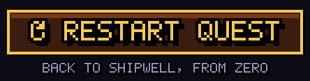</a>

<a href="https://es.linkedin.com/in/alexandercuriel/en">LinkedIn</a> · <a href="https://github.com/spotahome">Spotahome</a> · continue? it depends™ (and I'll tell you on what)

